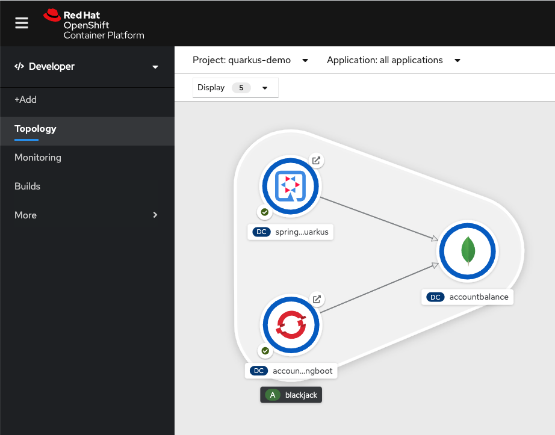

# springboot-2-quarkus
Example to demonstrate how to migrate a Springboot app to Quarkus. 

Then also we can test and compare both apps running over a K8s instance (like Openshift).


*This code is taken from*: 
https://developers.redhat.com/blog/2020/04/10/migrating-a-spring-boot-microservices-application-to-quarkus 
and 
https://developers.redhat.com/blog/2019/11/21/event-based-microservices-with-red-hat-amq-streams/

I've make this short version of those demos just to simplify the main concept of "How Migrate Springboot App to Quakus Runtime" from scratch, step by step and also show a simple way to compare each other in therms of CPU and Memory usage.

Pre requisites:
* OpenJDK 11 (or other JDK distribution)
* Maven (3.6.x)
* GraalVM 20.1.0.r11 ([here](./installing-graalvm.md) how to install)

1. Deploy a MongoDB data base in Openshift

```
oc login <you_openshift_api_url>
oc new-project quarkus-demo
oc new-app -f mongodb-template.yaml
```

2. Port Forward: access MongoDB instance locally

First we need to create a port-forward from the remote MongoDB instance in order to create a local connection.

```
oc get pods
```

You should see something like:

```
NAME                      READY   STATUS      RESTARTS   AGE
accountbalance-1-deploy   0/1     Completed   0          80s
accountbalance-1-zhfmk    1/1     Running     0          78s
```

Now we know the name of the pod so we can make the port forwarding. MongoDB is exposed with the port 27017 so we are going to forward the same port locally:

```
oc port-forward creditresponse-1-jtgxh 27017:27017
```

Now we are ready to deploy aour apps locally.

3. Run SpringBoot app

Note the application-dev.properties file. In this file is where the connection parameters are set. We are going to use this "profile" to connect to the local (remote) MongoDB instance.


```
cd accountbalance
mvn spring-boot:run -Dspring.profiles.active=dev
```

You should see a log like this:

```
2020-06-25 10:33:26.153  INFO 18923 --- [           main] s.b.c.e.t.TomcatEmbeddedServletContainer : Tomcat started on port(s): 8081 (http)
2020-06-25 10:33:26.158  INFO 18923 --- [           main] c.g.d.p.accountbalance.Application       : Started Application in 3.454 seconds (JVM running for 6.635)
2020-06-25 10:33:26.957  INFO 18923 --- [localhost:27017] org.mongodb.driver.connection            : Opened connection [connectionId{localValue:1, serverValue:56}] to localhost:27017
2020-06-25 10:33:27.151  INFO 18923 --- [localhost:27017] org.mongodb.driver.cluster               : Monitor thread successfully connected to server with description ServerDescription{address=localhost:27017, type=STANDALONE, state=CONNECTED, ok=true, version=ServerVersion{versionList=[3, 2, 10]}, minWireVersion=0, maxWireVersion=4, maxDocumentSize=16777216, roundTripTimeNanos=192940913}
2020-06-25 10:33:27.152  INFO 18923 --- [localhost:27017] org.mongodb.driver.cluster               : Discovered cluster type of STANDALONE
```

Here we can see that the SpringBoot version of this app take 3.454 seconds to run.

Let's try the Quarkus flavor of this app.

4. Run the Quarkus app (with JDK)

```
cd ../accountbalance-quarkus
mvn quarkus:dev  
```

You should see a log like this:

```
2020-06-25 10:36:26,866 INFO  [io.quarkus] (main) account-service 1.0.0 (running on Quarkus 1.2.1.Final) started in 2.685s. Listening on: http://0.0.0.0:8082
2020-06-25 10:36:26,867 INFO  [io.quarkus] (main) Profile dev activated. Live Coding activated.
2020-06-25 10:36:26,867 INFO  [io.quarkus] (main) Installed features: [cdi, mongodb-client, mongodb-panache, resteasy, resteasy-jsonb, smallrye-context-propagation, smallrye-reactive-streams-operators, vertx]
```

Here we can see that the Quarkus version of this app take 2.685 seconds to run.

Let's try the Quarkus Native flavor of this app (with GraalVM Native)

5. Run the Quarkus app (with GraalVM Native)

> You should first install GraalVM Native in your workstation. [Here](./installing-graalvm.md) a quick and easy how to install.

Firts we need to compile our quarkus app in a native way. This should take some time (2-3 minutes depending on your machine)

```
./mvnw package -Pnative
```

You should see a log like this:


This creates a file in your ./target directory called "account-service-1.0.0-runner". That file is the one we are going to execute.

```
./target/account-service-1.0.0-runner
```

You should see a log like this:

```
2020-06-25 10:56:34,965 INFO  [org.mon.dri.cluster] (main) Cluster created with settings {hosts=[localhost:27017], mode=SINGLE, requiredClusterType=UNKNOWN, serverSelectionTimeout='30000 ms', maxWaitQueueSize=500}
2020-06-25 10:56:34,966 INFO  [org.mon.dri.cluster] (main) Cluster created with settings {hosts=[localhost:27017], mode=SINGLE, requiredClusterType=UNKNOWN, serverSelectionTimeout='30000 ms', maxWaitQueueSize=500}
2020-06-25 10:56:34,969 INFO  [io.quarkus] (main) account-service 1.0.0 (running on Quarkus 1.2.1.Final) started in 0.021s. Listening on: http://0.0.0.0:8082
```

Here we can see that the same Quarkus app but compile as Native take 0.021 seconds to run. Just Awesome.

Let's try now to deploy this apps in Openshift environment.

6. Deploying to Openshift

#### Import the Red Hat Quarkus s2i UBI Image
```
oc import-image quay.io/quarkus/ubi-quarkus-native-s2i:20.1.0-java11 --confirm
```

#### Deploy the SpringBoot App in Openshift
oc new-build --name accountbalance-springboot --binary --strategy source --image-stream java:11
oc start-build accountbalance-springboot  --from-dir=./accountbalance
oc new-app accountbalance-springboot \
	-p APPLICATION_NAME=accountbalance-springboot \
    -e MONGODB_SERVER_HOST=accountbalance \
    -e MONGODB_SERVER_PORT=27017 \
    -e MONGODB_USER=accountbalance \
    -e MONGODB_PASSWORD=accountbalance \
    -e MONGODB_DATABASE=accountbalance

#### Deploy the Quarkus App (native image) in Openshift
oc new-build --name accountbalance-quarkus --binary --strategy source --image-stream=ubi-quarkus-native-s2i:20.1.0-java11
oc start-build accountbalance-quarkus --from-dir=./accountbalance-quarkus \
--name=accountbalance-quarkus
oc new-app quarkus-demo/accountbalance-quarkus:latest \
	-p APPLICATION_NAME=accountbalance-quarkus \
    -e MONGODB_SERVER_HOST= accountbalance \
    -e MONGODB_SERVER_PORT=27017 \
    -e MONGODB_USER= accountbalance \
    -e MONGODB_PASSWORD= accountbalance \
    -e MONGODB_DATABASE= accountbalance

Expose the services:
oc expose svc/springboot-2-quarkus --name=accountbalance-quarkus
oc expose svc/accountbalance-springboot --name=accountbalance-springboot

Add some labels:
oc label dc/accountbalance app.openshift.io/runtime=mongodb --overwrite
oc label dc/accountbalance-springboot  app.openshift.io/runtime=spring-boot --overwrite
oc label dc/accountbalance-quarkus app.openshift.io/runtime=quarkus —overwrite

Go to the Openshift's Web Console > Developer View > Topology

You should see your apps deployed like this:

